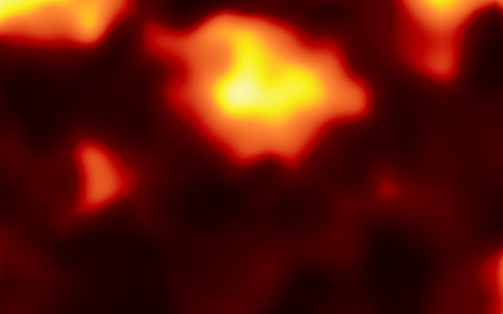

Choropleth Image Processing
===========================

Compile It
----------
ant

Run It
------
./target/choroplethimageprocessing.jar './resources/input.png' './resources/output.png' 20

input

output

